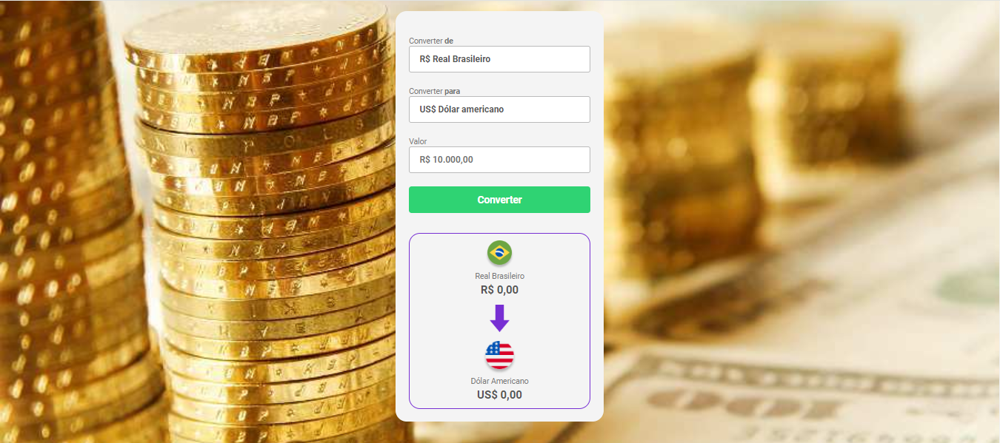

## Conversor de Moedas - Convert Money

## Sobre

* Esta aplicação é um conversor de moedas simples e eficiente, permitindo aos usuários converter valores usando uma API da AwesomeAPI (https://docs.awesomeapi.com.br/api-de-moedas) entre Real Brasileiro (BRL), Dólar Americano (USD) e Euro (EUR). Utilizando tecnologias web padrão, como HTML, CSS e JavaScript, o conversor oferece uma interface intuitiva e responsiva para uma experiência de usuário agradável.

## Recursos Principais
  
* Conversão Rápida e Precisa: Com uma interface minimalista e intuitiva, os usuários podem facilmente inserir o valor em Real Brasileiro e selecionar a moeda de destino (Dólar ou Euro). O conversor realizará instantaneamente a conversão utilizando as taxas de câmbio mais recentes usando a AwesomeAPI.

* Design Responsivo e Atraente: Desenvolvido com HTML5 e CSS3, o conversor apresenta um layout responsivo que se adapta perfeitamente a uma variedade de dispositivos, desde desktops até smartphones, proporcionando uma experiência consistente em todas as plataformas. <

## Tecnologias Utilizadas
    
*  
* 
* 

## Contribuição

* Contribuições são bem-vindas, sinta-se à vontade para Clonar o repositório ou enviar Pull requests.

## Website 🌐 ➡️ https://danielolivermoco.github.io/convert-money/

 
